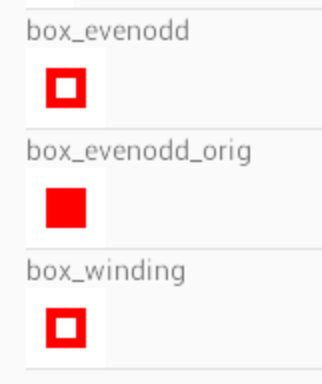

## How to hack this SampleApp

The sample application contains two vector drawables;
[`box_evenodd`](https://github.com/dagezi/vector_be_winding/blob/ver_0_9_0/sampleApp/app/src/main/res/drawable/box_evenodd.xml) and
[`box_winding`](https://github.com/dagezi/vector_be_winding/blob/ver_0_9_0/sampleApp/app/src/main/res/drawable/box_winding.xml).

If you compile and run this app, you'll see those two drawables as following.


The reason why `box_evenodd` is missing the hole is
the drawable doesn't follow "winding" rule, but "even-odd" rule.
On the other hand, `box_winding` is following "winding" rule.

If you run the `vbw` command as following, 
`box_evenodd` will be converted to follow winding rule and
the original file will be renamed to `box_evenodd_orig`:

```
% vbw -v -i '%{d}/%{r}_orig%{e}' app/src/main/res/drawable/*.xml
Not winding: app/src/main/res/drawable/box_evenodd.xml
```

When you rebuild the app, you can see `box_evenodd` with its hole:



With `Show ones with orig` menu,
you only see drawables suffixed by `orig` and its original.
It will be useful when you copy your
drawables under `drawable` directory and see how `vbw` commands works.

